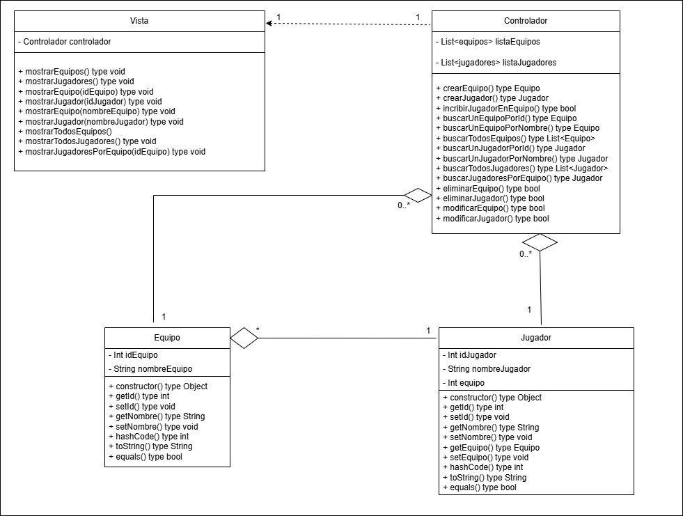

# Sistema de Gestión de Torneos de eSports
## Autor
Pablo Teran Rueda
PabloTeranRueda
## Descripción del Proyecto
[Link al repositorio del proyecto](https://github.com/PabloTeranRueda/torneo-esports-uml)
Este proyecto implementa un sistema de gestión de torneos de eSports
utilizando UML para el modelado y Java para la implementación.
## Diagramas UML
### Diagrama de Casos de Uso

### Diagrama de Clases

## Estructura del Proyecto
torneo-esports-uml/ ├── src/
│ ├── es/empresa/torneo/
│ │ ├── modelo/
│ │ ├── control/
│ │ ├── vista/
│ │ ├── Main.java
├── diagrams/
│ ├── casos-uso.png
│ ├── clases.png
├── README.md
├── .gitignore
├── LICENSE (opcional)
## Instalación y Ejecución
1. Clonar el repositorio:
`git clone https://github.com/usuario/torneo-esports-uml.git`
2. Compilar y ejecutar el proyecto:
`cd src javac es/empresa/torneo/Main.java java es.empresa.torneo.Main`
## Justificación del diseño
En el diseño de casos de uso, se ha tenido en cuenta el caso de gestión de equipos y jugadores. En este caso, se solicita que el usuario pueda realizar las siguientes acciones: Registrar un equipo, añadir jugadores a un equipo y consultar la lista de equipos y jugadores (entendiendo esta como la consulta de los equipos existentes y los jugadores que hay en ellos).
Estas acciones son dependientes entre sí y se incluyen unas dentro de otras de la siguiente manera: a) para poder consultar la lista de equipos y jugadores, es necesario que existan equipos y jugadores en el sistema; b) para poder añadir jugadores a un equipo, es necesario que exista un equipo.

En este caso, pueden existir distintos actores o usuarios del sistema: 
- El administrador que regule el uso de la aplicación necesitará tener todos los permisos y poder realizar todas las acciones.
- Los representantes de los equipos que se vayan a registrar en un torneo necesitarían poder realizar también todas las acciones.
- Un jugador o participante del torneo necesitará poder consultar la lista de equipos y jugadores, pero no añadirá jugadores a un equipo ni registrará un equipo nuevo en el sistema.
- Un expectador o asistente del público (un usuario que no participa en el torneo) querrá poder consultar la lista de equipos y jugadores, pero tampoco añadirá jugadores a un equipo ni registrará un equipo nuevo en el sistema.

En cuanto al diagrama de clases, se han identificado 4 clases principales, de las cuales 2 son entidades (equipo y jugador), 1 es clase de control (controlador) y otra es la interfaz del sistema (Vista).
Se ha decidido que 'controlador' almacenará una lista de los equipos existentes y otra lista de los jugadores existentes, por lo que la relación controlador-equipo y controlador-jugador es de agregación. Dado que un equipo/jugador pertenecerá a un controlador y un controlador puede tener varios equipos y jugadores, la multiplicidad es de 1..*.

Siguiendo esta línea, se ha decidido que 'jugador' almacenará el id del equipo al que pertenece, con el fin de que se pueda comparar este id al hacer búsquedas para encontrar al jugador en función de su equipo. Por ello, existe una relación equipo-jugador, que hemos clasificado como de agregación al ser dos entidades completamente independientes entre sí: un equipo no dejará de existir porque un jugador se elimine y un jugador debe poder existir en el sistema sin un equipo, dado que puede darse el caso de existan jugadores libres, en búsqueda de equipo, o en transición entre equipos. Un equipo tendrá muchos jugadores y un jugador pertenecerá solo a un equipo, por lo que se ha fijado la multiplicidad entre estas relaciones como *..1.

Por último, la clase Vista será la encargada de imprimir en pantalla los datos solicitados, por lo que necesitará guardar un 'controlador'. Esta es sin duda una relación de dependencia, dado que una 'vista' necesita de un 'controlador' para poder ejecutar acciones. La multiplicidad entre estas clases será de 1 a 1.

## Conclusiones
Existen múltiples formas de escribir y organizar el código de una aplicación. Poder llevar a cabo una planificación previa permite acotar todas las casuísticas y posibilidades de uso de una aplicación, y permite tener en cuenta qué piezas vamos a necesitar en nuestro código y cómo se van a comportar. Además, esta planificación es clave para prevenir errores y evitar emplear a futuro un tiempo excesivo o mayor a lo esperado a la hora de realizar cambios en la aplicación.